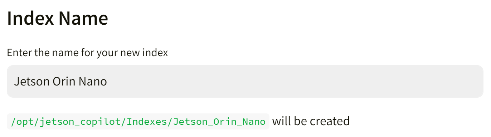
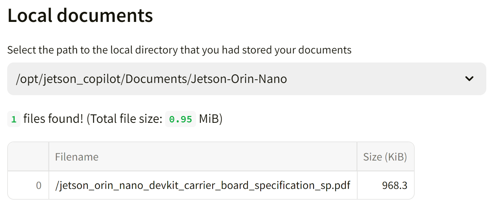

# Jetson Copilot

Jetson Copilot is a reference application for a ***local*** AI assistant.

It deonstrates two things;

- Running open-source LLMs (large language model) on device
- Augumenting the LLM to have access to your locally indexed knowledge (**RAG**, retrieval-augmented generation)

> [!IMPORTANT]
> 
> This project will download and install additional third-party open source software projects. Review the license terms of these open source projects before use.
> 
> | OSS | Repo URL | Usage |
> | --- | --- | ----- |
> |[Ollama](https://www.ollama.com/)|[GitHub](https://github.com/ollama/ollama)|To host and run LLMs locally, including embedding models for building index from documents |
> | [LlamaIndex](https://www.llamaindex.ai/) | [GitHub](https://github.com/run-llama/llama_index) | Data framework for LLM, used mainly to realize RAG pipeline. |
> | [Streamlit](https://streamlit.io/) | [GitHub](https://github.com/streamlit/streamlit) | Python library to create an interactive web app |


## 🏃 Getting started

### First time setup

If this is your first time to run Jetson Copilot on your Jetson, first run `setup_environment.sh` to ensure you have all the necessary software installed and the environment set up. 

```bash
git clone https://github.com/NVIDIA-AI-IOT/jetson-copilot/
cd jetson-copilot
./setup_environment.sh
```

It will install the following, if not yet.

- Chromium web browser
- Docker

> [!IMPORTANT]
> 
> It also adds the current user into `docker` group using `newgrp` command.
>
> Check to see if you can just issue the following command (without using `sudo`).
> 
> ```bash
> docker ps
> ```
> 
> If you get `permission denied` error, exit from the session (by executing `exit` command) and log/ssh back in.<br>
> You should now be able to issue `docker ps`.

### How to start Jetson Copilot

```bash
cd jetson-copilot
./launch_jetson_copilot.sh
```

https://github.com/NVIDIA-AI-IOT/jetson-copilot/assets/25759564/e2e99d47-7a17-4b1b-870a-d5d376e2cae3

This will start a Docker container and start a Ollama server and Streamlit app inside the container. It will shows the URL on the console in order to access the web app hosted on your Jetson.

With your web browser on Jetson, open the **Local URL** (`localhost`). Or on a PC connected on the same network as on your Jetson, access the **Network URL**.

```bash
Local URL: http://localhost:8501
Network URL: http://10.110.50.252:8501 
```

> [!NOTE]
> You will need the Internet connection on Jetson when it launches for the first time, as it will pull the container image (and download the default LLM and embedding model when web UI starts for the first time).

When you access the web UI for the first time, it will dowload the default LLM (`llama3`) and the embedding model (`mxbai-embed-large`).

> [!TIP]
> If you are on Ubuntu Desktop, a frameless Chromium window will pop up to access the web app, to make it look like an independent application.
> You need to close the window as stopping the container on the console won't shutdown Chromium.
> 
> https://github.com/NVIDIA-AI-IOT/jetson-copilot/assets/25759564/422fc036-890a-4c72-aa90-52cfb656ed57

## 📖 How to use Jetson Copilot

### 0. Interact with the plain Llama3 (8b)

https://github.com/NVIDIA-AI-IOT/jetson-copilot/assets/25759564/6aed539c-08b3-448f-8cbc-3e20abfa782f

You can use Jetson Copilot just to interact with a LLM withut enabling RAG feature.

By default, Llama3 (8b) model is downloaded when running for the first time and use as the default LLM.

You will be surprized how much a model like Llama3 is capable, but may soon find limitations as it does not have information prior to its cutoff date nor know anything about your specific subject matter.

### 1. Ask Jetson related question using pre-built index

https://github.com/NVIDIA-AI-IOT/jetson-copilot/assets/25759564/c187f0de-a998-463e-acf8-2e793e523e98

On the side panel, you can toggle "Use RAG" on to enable RAG pipeline.<br>
The LLM will have an access to a custom knowledge/index that is selected under "Index".

As a sample, a pre-build index "`_L4T_README`" is provided.<br>
This is built on all the README text files that supplied in the "L4T-README" folder on the Jetson desktop.

> It is mounted as `/media/<USER_NAME>/L4T-README/` once you execute `udisksctl mount -b /dev/disk/by-label/L4T-README`.

You can ask questions like:

```
What IP address does Jetson gets assigned when connected to a PC via a USB cable in USB Device Mode?
```

### 2. Build your own index based on your documents

https://github.com/NVIDIA-AI-IOT/jetson-copilot/assets/25759564/c333833a-9a4a-4d57-9216-d3d464466d3c

You can build your own index based on your local and/or online documents.

First, on the console (or on the desktop) create a directory under `Documents` directory to store your documents.

```bash
cd jetson-copilot
mkdir Documents/Jetson-Orin-Nano
cd Documents/Jetson-Orin-Nano
wget https://developer.nvidia.com/downloads/assets/embedded/secure/jetson/orin_nano/docs/jetson_orin_nano_devkit_carrier_board_specification_sp.pdf
```

Now back on the web UI, open the side bar, toggle on "Use RAG", then click on "**➕Build a new index**" to jump to a "**Build Index**" page.

Give a name for the Index you are to build. (e.g. "JON Carrier Board")<br>
Type in the field and hit `Enter` key, then it will check and show what path will be created for your index.

> 

And then from the drop select box under "**Local documents**", select the directory you created and saved your documents in. (e.g. `/opt/jetson_copilot/Documents/Jetson-Orin-Nano`).

It will show the summary of files found in the selected directory.

> 

If you want to rather only or additionally supply URLs for the online docuemnts to be ingested, fill the text area with one URL per a line.<br>
You can skip this if you are building your index only based on your local documents.

> [!NOTE]
> On the sidebar, make sure `mxbai-embed-large` is selected for the embedding model.
> 
> Use of OpenAI embedding models is not well supported and needs more testing.

Finally, hit "**Build Index**" button.<br>
It will show the progress in the drop-down "status container", so you can check the status by clicking on it.<br>
Once done, it will show the summary of your index and time it took.

You can go back to the home screen to now select the index you just built.

### 3. Test different LLM or Embedding model

TODO

## 🏗️ Development

Streamlit based web app is very easy to develop.

On web UI, at the top-right of the screen, choose "**Always rerun**" to automatically update your app every time you change the source codes.

See [Streamlit Documentation](https://docs.streamlit.io/get-started/fundamentals/main-concepts#development-flow) for the detail.

### Manually run streamlit app inside the container

In case you make more fundamental changes, you can also manually run streamlit app.

```bash
cd jetson-copilot
./launch_dev.sh
```

Once in container;

```bash
streamlit run app.py
```

https://github.com/NVIDIA-AI-IOT/jetson-copilot/assets/25759564/7ec4552a-bd55-4325-8167-d8429324b1bd

## 🧱 Directory structure

```
└── jetson-copilot
    ├── launch_jetson_copilot.sh
    ├── setup_environment.sh
    ├── Documents 
    │   └── your_abc_docs
    ├── Indexes
    │   ├── _L4T_README
    │   └── your_abc_index
    ├── logs
    │   ├── container.log
    │   └── ollama.log
    ├── ollama_models
    └── Streamlit_app
        ├── app.py
        ├── build_index.py
        └── download_model.py
```

Following directories inside the `jetson-copilot` directory are mounted in the Docker container.

| Directory Name | Description |
| -------------- | ----------- |
| `Docuemtns`    | Directory to store your documents to be indexed |
| `Indexes`      | Directory to store pre-built (or built-by-you) indexes for LLM to perform RAG on |
| `logs`         | Directory for the app to store log files |
| `ollama_models`| Directory for the ollama server to store download models |
| `stremlit_app` | Directory for Python scripts to make up the web app |


## 💫 Troubleshooting

If you find any issue, please check [GitHub Issues of the Jetson Copilot repo](https://github.com/NVIDIA-AI-IOT/jetson-copilot/issues).

## Supposed usage

You can use Jetson Copilot in multiple ways.

### Useful and tool

Users can easily run an LLM on Jetson without relying on any cloud services.<br>

They may find the AI assistantce on some tasks useful, like to find out the right  command to use on Linux system. They can even expand the LLM knowledge by building the local index based on their own documents that LLM can access.

### Reference for budling a custom AI assistant

Developers can use Jetson Copilot as a reference for building their own AI assistant that poseses some specific domain area's or product's knowledge.

## ⚖️ License
Please see LICENSE file.

## 📜 Project status
Pushed to public, still partially in development.

### TODO

- [x] LLM download UI (`download_model.py`)
- [ ] Use `faiss` for Vector DB
- [ ] Support OpenAI embedding models